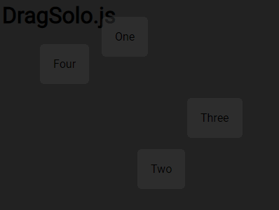

# DragSolo.js

> Simplicity in Motion.

`DragSolo.js` offers a focused, efficient, and streamlined dragging experience. This lightweight library is dedicated solely to dragging functionalities, designed for developers seeking a no-nonsense approach to drag-and-drop features. With an emphasis on simplicity and ease-of-use, DragSolo provides exactly what you need — pure dragging capabilities, without any excess.




## Getting Started

Include `dragsolo.js` in your HTML. For a plug-and-play experience, apply a selector in the script:

```html
<script src="js/dragsolo.js" dragsolo-selector='.box'></script>
```
And you're good to go!

## Manual Setup

If you're not using the `dragsolo-selector` attribute on the script tag, set up the drag host manually:

```js
const dragHost = new DragSolo();
dragHost.enable('.box');
```

Again, you're good to go!

---

DragSolo is designed to easily plug in and deliver smooth dragging. Once set up, you can forget about it and focus on more pressing matters.

